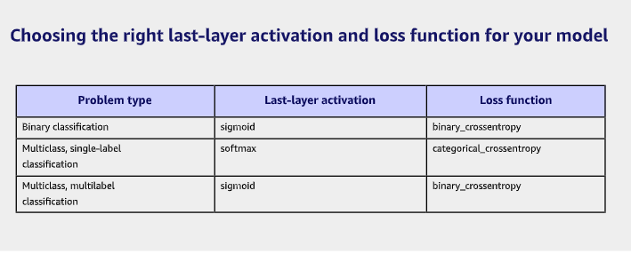

# Chapter 6 - The universal workflow of machine learning

## Define the task

### Frame the problem
 - What will your input data be?
 - What are you trying to predict?
 - What type of machine learning task are you facing?
   - Binary classification, Multiclass classification, Scalar regression,
     Vector regression, Multiclass Multilabel classification, Image Segmentation,
     etc. 

### Collect a Dataset

- This is the most arduous and cost part of the process
- It is also the most important
- Remember the ability to generalized flows from the properties of the data
- If you get extra time for a project, returns will be good if you work on the 
  data

### Investing in data annotation infrastructure

Making sure your labels are good is a wise investment.

### Beware of non-representative data

- Make sure your data is represenatative. Use proper sampling when appropriate
- Make sure your training set is representative
- Avoid sample bias
- Always get to know your data through exploratory analysis

### Chose a measure of success

- Choose metrics appopriate your problem

### Develop a Model

enough said!

#### Vectorization & Normalization

Make sure all inputs are floating point tensors
Make sure all of your inputs are normalized.
Do not feed a neural network values that are unevenly large or small.

#### Handle Missing Values

### Choose an evaluation protocol

These are your validation metrics. you can use the validation approaches used
in chapter 5.

### Beat the baseline

- Feature Engineering
- Select the right architecture
- Pick the right loss function

### Choosing the right activation function

#### Scale up and overfit

#### Regularize and tune your model

### Deploy the model

- Make sure you appropriately set expectations before the model launches
- The model will often have to be adjusted to be put into production

#### Deployment Options

- Deploy it as a REST API
    - Application will have reliable access to the internet
    - no strict latency requirements (500ms)
    - Input data for inference is not highly sensistive
- Deploy a model on a device
    - Use this when there are strict latency constraints
    - Your model can be sufficiently small for the task
    - Highest possible accuracy is **not** mission critical
    - Tensorflow can be deployed on a smart phone or embedded device
- Deploy in a browser
    - Use this when you want to offload compute to the user
    - Input data neeeds to stay on a phone.
    - Application has strict latency constraints
    - App needs to work w/o connectivity
    - To deploy a model in javascript there is Tensorflow.js

### Inference Model Optimization

- Optimize the model before putting it into a browser

#### Optimization techniques

Weight pruning - not all coefficients are equally useful. Get rid of parameters
by getting rid of the less important ones

Weight quantization - Quantize weights from float32 to int8 and reduce the model
to a quarter of the size and keep the accuracy of the original model.

### Monitor the model in the wild

- Models can degrade over time
    - Monitor User Engagement
    - keep an eye on its predictive performance
    - Keep an eye on model drift. No model lasts forever
    - 

